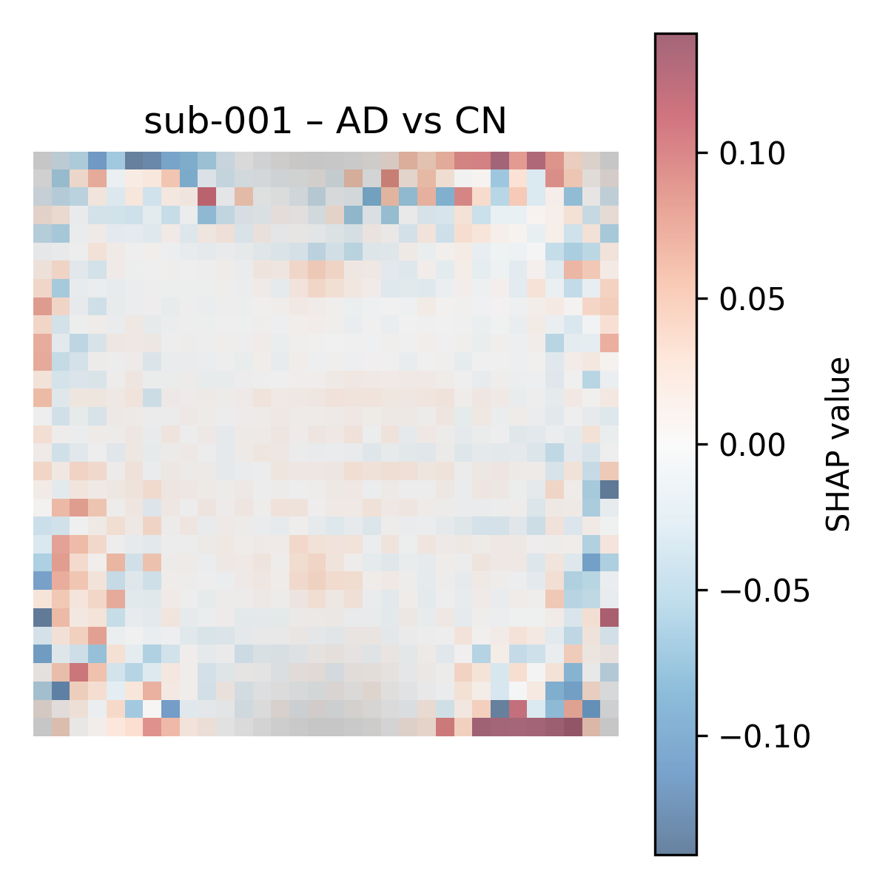
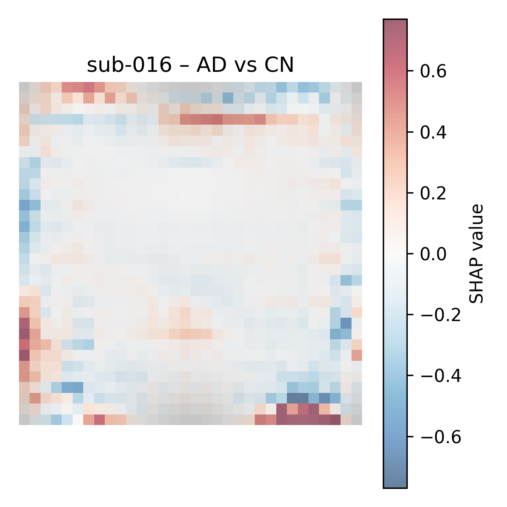
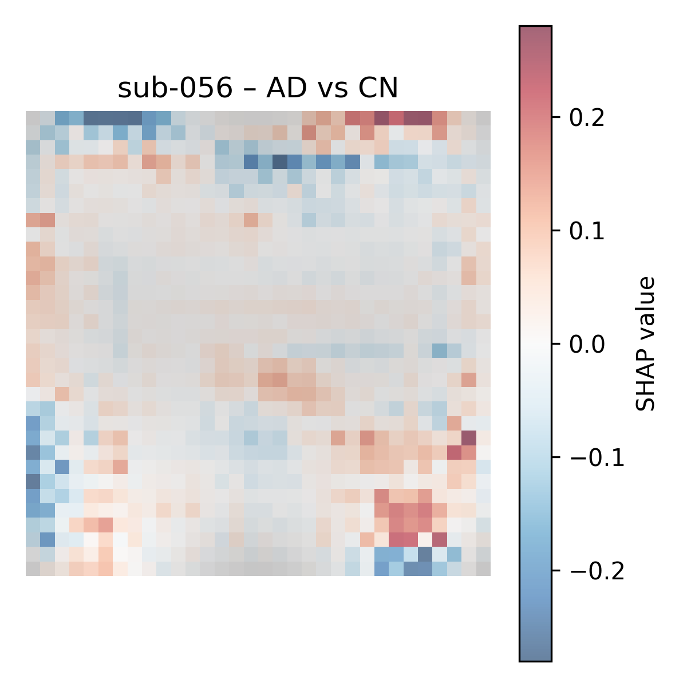
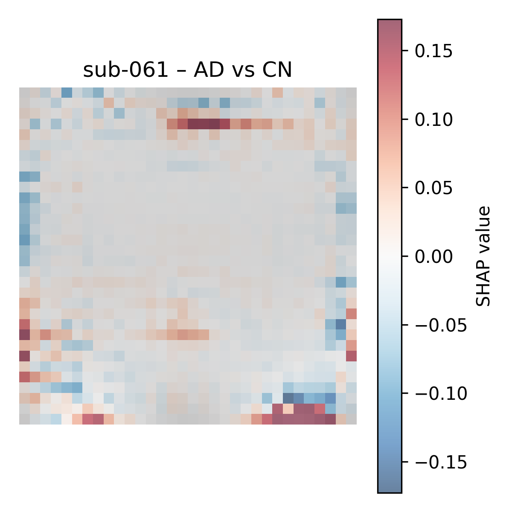
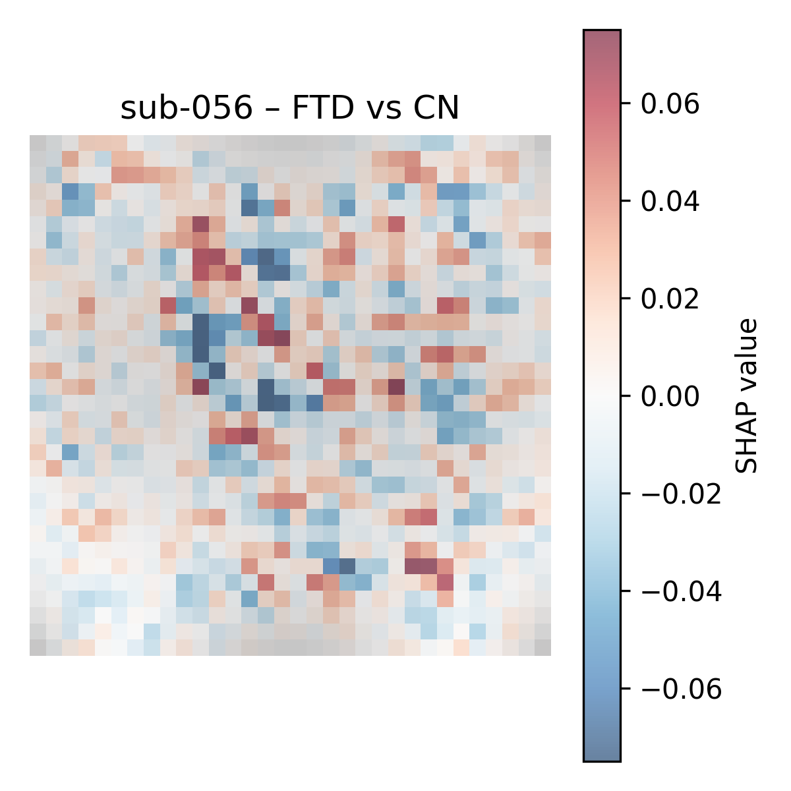
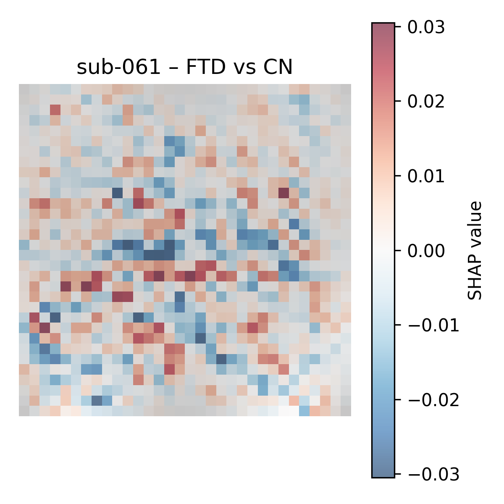
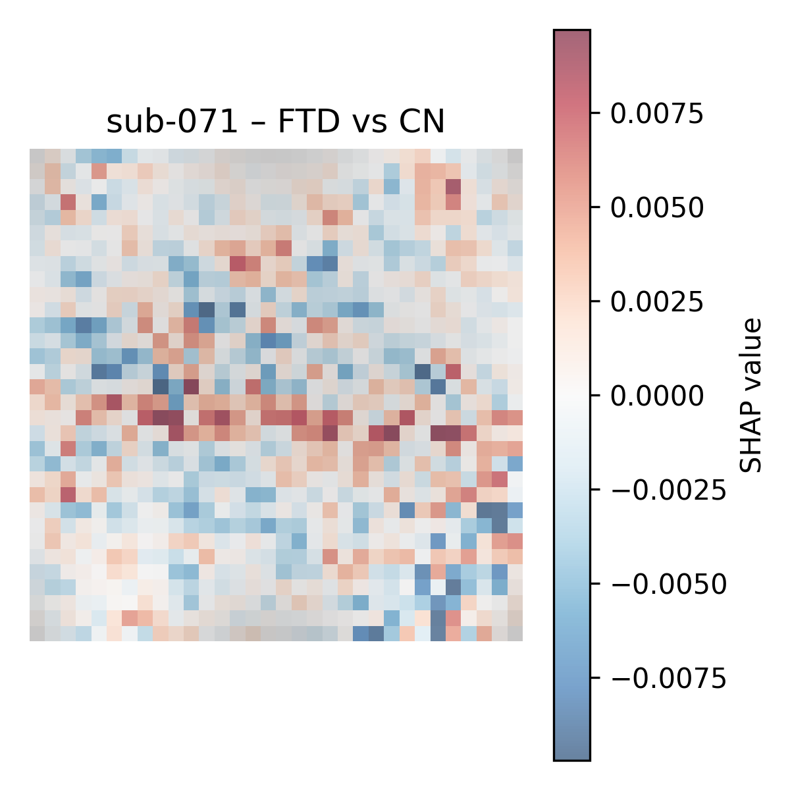
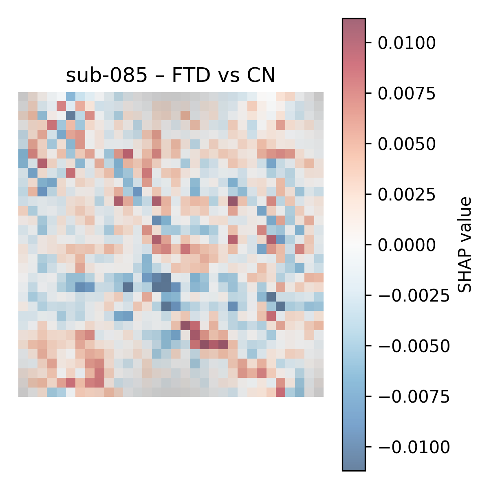

# Alzheimer's Disease Detection Using EEG Topographic Images

---

## Overview
The project investigated feature representations for EEG-based Alzheimer's Disease detection, comparing **1D raw signals** with **2D image-like representations** derived from EEG signals. Both representations are evaluated using CNN-based architectures.

The main question is whether representing EEG signals with **explicit spatial mapping** can improve classification performance and provide better explainability. To address this, the project implemented:
- EEG signal-to-image feature transformation
- Nested Leave-One-Subject-Out cross-validation
- Model comparison

## Problem Statement
Alzheimer's Disease (AD) is a major neurological disorder affecting over 57 million people worldwide, with the majority of cases happening in less developped regions. Electroencephalography (EEG) offers an alternative for non-invasive, affordable, and widely-available clinical diagnosis. 

Challenges in EEG-based AD detection: 
- **Noisy, non-linear, non-stationary signals:** Currently no formally recognised EEG biomarkers for AD detection. 
- **Spatial nature of AD pathology:** AD disrupts inter-neuron connections in spatially distributed patterns, while EEG signals are rich in temporal information.
- **Uncertainty in feature representation:** Deep learning is widely used in EEG-based AD detection due to its ability to automatically extract features. However, the lack of large-scale public datasets makes it difficult to develop specialised models. As a result, EEG signals are often transformed to align with architecures from more mature fields, such as computer vision and natural langugage processing. The optimal feature representation for deep learning models remains unclear.
- **Limited data and generalisability:** Clinical EEG datasets are typically small, making it difficult to train robust models and raises concerns about model's generalisation.

## Methods


## Repository Structure
```
THESIS_CODES/
│
├── data/                                # data folder
|
├── docs/                                # Flowcharts
│
├── notebooks/                           # EDA, feature analysis and model comparison
│
├── scripts/
│   └── baseline.sh                      # GPU job submission scripts
│
├── src/
│   ├── models/                          # Model files directory
│   ├── calculate_results.py             # Compute evaluation metrics
│   ├── callback.py                      # Training callbacks (early stopping)
│   ├── cross_validation.py              # Cross-validation logic
│   ├── dataset.py                       # Custom PyTorch dataset
│   ├── eeg_processor.py                 # Transform signals into images (single subject)
│   ├── feature_loader.py                # Load image feature and synchronise with labels
│   ├── model_trainer.py                 # Train, evaluate and predict
│   ├── model_tuner.py                   # Hyperparameter tuning
│   ├── subject_processor.py             # Image transformation (all subjects)
│   ├── util.py                          # Helper functions
│   └── __init__.py
│
├── tests/
│   ├── test_processor.py                # Test eeg_processor.py 
│   ├── test_subject.py                  # Test subject_processor.py
│   └── __init__.py
│
├── eegnet_baseline.py                   # 1D EEG signal feature training pipeline
├── experiment.py                        # Single train/test split for quick model behaviour check
├── main.py                              # 2D image feature training pipeline
├── environment.gpu.yml                  # Environment setting for GPU
├── environment.local.yml                # Environment setting for CPU 
├── .gitignore
├── .gitlab-ci.yml
├── README.md
└── requirements.txt

```

## Dataset
Dataset is publicly available on OpenNeuro: https://openneuro.org/datasets/ds004504/versions/1.0.7. 

Resting-state eyes-closed EEG recordings with 19 channels at 500Hz sampling rate. The subject groups include Alzheimer's Disease (AD), Frontaltemporal Dementia (FTD), and healthy controls (CN). 

## Results

### Summary
- EEGNet with 1D features consistently outperformed other models, with an AUROC of 0.82 in Alzheimer's Disease classification, balanced sensitivity and specificity, as well as unbiased prediction between male and female subjects. 
- Frontotemporal dementia proved a challenging dementia type for all models. 
- Frenquency band analysis revealed Delta and Alpha bands to be the most informative for Azheimer's Disease; no single band yielded strong results for Frontotemporal dementia. 
- Subject-level analysis showed considerable inter-subject variability. 
- SHAP-based explainability revealed discriminative spatial patterns for Alzheimer's Disease but not for Frontotemporal dementia. 

### Explainability

#### EEGNet spatial filters
The spatial patterns learned in the 1D EENNet model were visualised by extracting learned spatial filters from the depthwise convolution layer.

<p align="center">
  
</p>

<p align="center">
  <i>Example EEGNet spatial filter topomap.</i>
</p>

#### 2D model SHAP explainability
For the 2D models, SHAP was applied to representative subjects from the AD vs. CN and FTD vs. CN classification tasks to visualise the contribution of spatial regions to model predictions.

##### AD vs. CN

For AD vs. CN, clearer spatial patterns and larger SHAP magnitudes were observed. Positive SHAP values (red) indicate regions contributing toward the AD prediction, while negative values (blue) indicate regions contributing away from the AD class. Some subjects exhibited concentrated high-value regions, suggesting that the model identified meaningful localised EEG patterns.

<div align="center">

<table>
  <tr>
    <td align="center">
      <br>
      <b>Example AD patient</b>
    </td>
    <td align="center">
      <br>
      <b>Example AD patient</b>
    </td>
  </tr>
  <tr>
    <td align="center">
      <br>
      <b>Example healthy control</b>
    </td>
    <td align="center">
      <br>
      <b>Example healthy control</b>
    </td>
  </tr>
</table>

<i>SHAP value visualisations for representative AD vs. CN subjects.</i>

</div>

##### FTD vs. CN
In contrast, the FTD vs. CN task showed lower SHAP magnitudes and more scattered feature importance distributions, indicating less consistent spatial patterns contributing to model predictions.

<div align="center">

<table>
  <tr>
    <td align="center">
      <br>
      <b>Example healthy control</b>
    </td>
    <td align="center">
      <br>
      <b>Example healthy control</b>
    </td>
  </tr>
  <tr>
    <td align="center">
      <br>
      <b>Example FTD patient</b>
    </td>
    <td align="center">
      <br>
      <b>Example FTD patient</b>
    </td>
  </tr>
</table>

<i>SHAP value visualisations for representative FTD vs. CN subjects.</i>

</div>

## Usage

### Dataset Download
Run the following command from the project root:
```
./scripts/download_data.sh
```
This will automatically:
- create the ```data/``` directory
- execute the official OpenNeuro download script
- download the dataset into ```data/```

After running the download, the dataset will be stored as:
```
├── data/
│   ├── ds004504-1.0.8/                  # data version
│   │   ├── derivatives/                 # Preprocessed data
│   │   │   ├── sub-001/                 # 1st subject
│   │   │   │    └── eeg/
│   │   │   │        └── sub-001_task-eyesclosed_eeg.set
|   |   |   ├─ ...
│   │   │   └── sub-088/
│   │   ├── sub-001/                     # Unprocessed EEG recordings
│   │   │   └── eeg/
│   │   │       ├── sub-001_task-eyesclosed_channels.tsv
│   │   │       ├── sub-001_task-eyesclosed_eeg.json
│   │   │       └── sub-001_task-eyesclosed_eeg.set
│   │   ├── ...
│   │   ├── sub-088/
│   │   ├── CHANGES
│   │   ├── dataset_description.json  
│   │   ├── participants.json            # Meta data mapping dictionary
│   │   ├── participants.tsv             # Meta data by each subject
│   │   └── README                       # Dataset description
```

### Image Extraction 
To extract images from the EEG signals, run:
```
python -m src.subject_processor
```
The default configurations, including frequency band and the sliding window size, can be adjusted by changing the arguments when calling the methods of ```SubjectProcessor``` class.
```
processor.choose_band(band_name="alpha")
processor.choose_window_size(window_size=4)
```

The images will be saved under a folder name which corresponds to the band name of your choice under ```/data/features/```. 

By implementing the above two steps, your data repository will be arranged as below: 

To test for image extraction steps in ```eeg_processor.py``` and ```subject_processor.py```, run: 
```
pytest -v
```

### Run Experiment

#### 1D feature
1D CNN model pipeline is implemented separately because the original EEGNet architecture is written in Keras. To run signal extraction and nested cross validation:
```
python eegnet_baseline.py
```

#### 2D feature
```
python main.py
```

## Future Direction


## References
